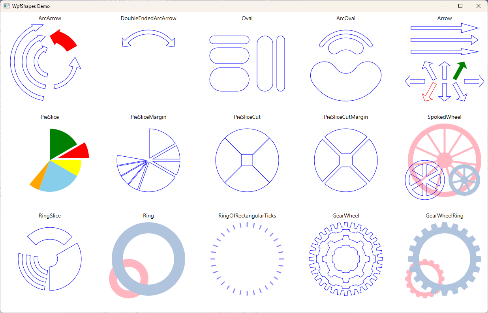

# WpfShapes

This is a library of some simple shapes for WPF projects.

This is a screen shot of the demo program.

 
All properties are defined as DependencyProperties and support binding.
 
Generally, my philosophy has been to keep simple shapes simple, and to add additional clases for more specialized shapes.
